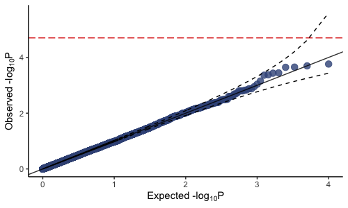

# plotQQ
This is an upgraded function from the [GenABEL](https://github.com/GenABEL-Project/GenABEL) package [[1]](#1). The package was previously removed from CRAN and the function was saved to avoid a more complicated installation of the package from source. This function has been upgraded to my taste and now returns a ggplot2 object, which allows more plot customization.

## References
<a id="1">[1]</a> 
Yurii S. Aulchenko, Stephan Ripke, Aaron Isaacs, Cornelia M. van Duijn.
GenABEL: an R library for genome-wide association analysis.
Bioinformatics, 23(10), 2007, 1294-1296.
https://doi.org/10.1093/bioinformatics/btm108

